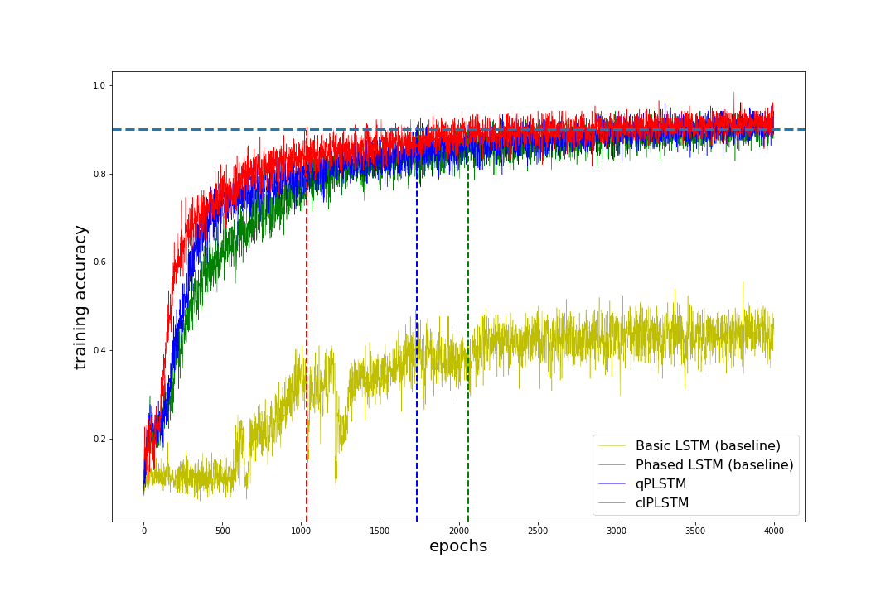

# Advanced Phased LSTM
We've modified the time gate function of Phased LSTM model and shown that the convergence speed of the modified model is better.
The time gate function was linear triangle shape function in the open phase, and leaky linear function in the closed phase.
Our model has two variants; the first one (qPLSTM) has the quadratic symmetric function in the open phase, and leaky linear function in the closed phase. 
the second (clPLSTM) has linear triangle shape function in the open phase, and constant zero function in the closed phase.

## Result

